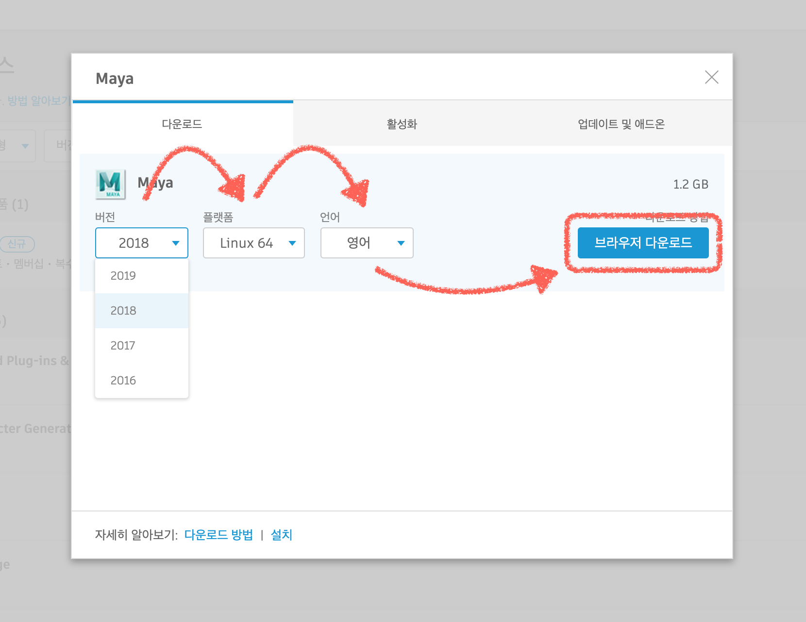

# Install Maya 2018 on CentOS 7.6

## Info

- 명령어 앞에 `#` 는 Root(루트) 계정을 뜻한다. `$` 는 일반 계정을 뜻한다.
- License Server & Client Computer OS: `CentOS 7.6`
- License Server Model: Single Server Model(단일 서버)
- Maya Version: `2018`
- 내려받은 파일들은 `~/Downloads` 디렉토리에 저장
- yum 명령어는 인터넷을 사용한다.
- Example Server Name: `storage`
- Example License File Name: `storage6003089af239.lic`

## [License Server](https://knowledge.autodesk.com/ko/customer-service/network-license-administration/get-ready-network-license/getting-network-license-file/generating-license-file)

1. Download Autodesk Network License Manager

    - [Autodesk Network License Manager for Linux](https://knowledge.autodesk.com/search-result/caas/downloads/content/autodesk-network-license-manager-for-linux.html)
    
    - 위에 링크에서 `nlm11.16.2.0_ipv4_ipv6_linux64.tar.gz` 파일 내려받기


1. Install the Autodesk Network License Manager

    ```
    # cd ~/Downloads
    
    # tar –zxvf nlm11.16.2.0_ipv4_ipv6_linux64.tar.gz

    # rpm -vhi nlm11.16.2.0_ipv4_ipv6_linux64.rpm
    ```

    - 위에 두줄을 입력하면 `/opt/flexnetserver/` 디렉토리에 라이센스 서버가 설치된다

1. 라이센스 서버의 `Host Name` 과 `Host ID`
    
    - Find **Host Name**
    ```
    # cd /opt/flexnetserver
    
    # ./lmutil lmhostid hostname 
    
    <Result>
    lmutil - Copyright (c) 1989-2013 Flexera Software LLC. All Rights Reserved.
    The FlexNet host ID of this machine is "HOSTNAME=storage"
    
    !! Host Name: storage !!
    ```
    
    
    - Find **Host ID**
    ```
    # cd /opt/flexnetserver
    
    # ./lmutil lmhostid
    
    <Result>
    lmutil - Copyright (c) 1989-2013 Flexera Software LLC. All Rights Reserved.
    The FlexNet host ID of this machine is "6003089af239"
    
    !! Host ID: 6003089af239 !!
    
    <참고>
    Host ID 가 여러개 출력되면 첫번째 주소를 사용한다.
    ```
    
    ```
    <오류>
    '/lib64/ld-lsb-x86-64.so.3: bad ELF interpreter: No such file or directory'
    
    <해결 방법>
    # yum -y install redhat-lsb
    ```
    
1. [Autodesk Account에서 네트워크 라이센스 파일을 생성](https://knowledge.autodesk.com/ko/customer-service/network-license-administration/get-ready-network-license/getting-network-license-file/generating-license-file)

    1. Autodesk Account 접속 - [https://manage.autodesk.com/home/](https://manage.autodesk.com/)
        - OTP | Google Authenticator
        
    1. 라이센스 서버 모델 선택
        
        .jpg)
        
        - 네트워크 환경에 맞는 라이센스 서버 모델을 선택한다.
        
        ```
        <참고>
        이 문서는 Single Server Model(단일 서버 모델) 내용만 다루고 있습니다.
        ```
    
        
        
        - 서버의 서버 이름 및 MAC 주소를 입력.
        - <kbd>+</kbd> 버튼을 클릭해 이 서버의 제품 라이센스를 선택.
    
    1. 사용 가능한 제품 선택
    
        
    
    1. 라이센스 파일 생성
    
        
    
        
        
    1. 서버에 라이센스 파일 복사
    
        - 라이센스 파일을 생성한 다음에는 라이센스 서버에 저장해야 한다.
        - 라이센스(.lic) 파일을 ```/opt/flexnetserver``` 디렉토리에 저장한다.


1. 네트워크 라이센스 서버를 시작하기
    ```
    # cd /opt/flexnetserver
    
    # ./lmgrd -c /opt/flexnetserver/adsk_license.lic -l /opt/flexnetserver/server_log.log
    ex) # ./lmgrd -c /opt/flexnetserver/storage6003089af239.lic -l /opt/flexnetserver/server_log.log
    ```

1. 라이센스 서버 상태 쿼리를 얻기
    ```
    # cd /opt/flexnetserver
    
    # ./lmutil lmstat -a -c /opt/flexnetserver/adsk_license.lic
    ex) # ./lmutil lmstat -a -c /opt/flexnetserver/storage6003089af239.lic
    ```

### 참고

1. 라이센스 서버 서비스를 중지하기
    ```
    # cd /opt/flexnetserver
    
    # ./lmutil lmdown -q -force
    ```

1. 시스템을 재부팅한 후 라이센스 서버를 자동으로 시작하기
    ```
    # chmod +x /etc/rc.d/rc.local
    
    # vim /etc/rc.d/rc.local
        >> touch /var/lock/subsys/local 
        >> /opt/flexnetserver/lmgrd -c /opt/flexnetserver/adsk_license.lic -l /opt/flexnetserver/server_log.log 
    ```


## Client Computer

1. Install Dependencies **(Maya 2018 CentOS 7.6)**
    
    ```
    # yum -y install mesa-libGLw mesa-libGLU libglvnd*64

    # yum -y install libXp libXpm libXmu libXt libXi libXext libX11 libXinerama libXau libxcb libXcomposite

    # yum -y install gamin audiofile audiofile-devel e2fsprogs-libs glibc zlib libSM libICE openssl098e tcsh pulseaudio-libs libxslt alsa-lib

    # yum -y install xorg-x11-fonts-ISO8859-1-100dpi xorg-x11-fonts-ISO8859-1-75dpi liberation-mono-fonts liberation-fonts-common liberation-sans-fonts liberation-serif-fonts

    # yum -y install libpng12 libtiff

    # cd /usr/lib64
    # ln -s libtiff.so.5 libtiff.so.3
    ```
    - [Download Script](https://gitlab.com/snippets/1690538)


1. Download Maya

    1. Autodesk Account 접속 - [https://manage.autodesk.com/home/](https://manage.autodesk.com/)
    
    1. 다운로드 보기
    
    
    1. 기본 버젼 다운로드
    
    
    1. 업데이트 버젼 및 애드온 다운로드
    

1. [Install Maya on Linux using the installation wizard](https://knowledge.autodesk.com/support/maya/troubleshooting/caas/CloudHelp/cloudhelp/2018/ENU/Installation-Maya/files/GUID-10FE31A8-7092-45BE-9E53-44D0D096E431-htm.html)

    1. 다운로드한 마야 앞축파일을 풀어준다    
        ```
        $ cd ~/Downloads
        $ mkdir maya2018
        $ mv Autodesk_Maya_2018_EN_Linux_64bit.tgz maya2018

        $ cd maya2018
        $ tar xpvf Autodesk_Maya_2018_EN_Linux_64bit.tgz

        $ su -    <중요> su 옆에 마이너스(-)를 입력해준다 <중요>
        
        # cd /home/$USER/Downloads/maya2018
        # ./setup.sh
        ```
    
    1. Installation Wizard
    
        - 라이센스 정보 입력
        
            라이센스 유형: :white_medium_square:독립 실행형 :white_square_button:네트워크
            
            일련 번호: `123-45678910` (11-digit)
            
            제품 키: `657J1`
            
            :white_square_button:기존 라이센스 서버 사용
            
            서버 이름: `10.0.0.100`
            
        
        
            
---

## Known Issues

### 마야 스타트업 속도 이슈

마야 스타트업 시간이 너무 오래걸리면 터미널에 아래의 코드를 입력한다.

```
$ echo "MAYA_DISABLE_CIP=1" >> ~/maya/2018/Maya.env
```

[관련 링크](https://forums.autodesk.com/t5/maya-forum/maya-2018-3-osx-slow-at-start-up/m-p/7983041#M58838)

[MAYA_APP_DIR 환경변수](https://knowledge.autodesk.com/support/maya/learn-explore/caas/CloudHelp/cloudhelp/2016/ENU/Maya/files/GUID-8EFB1AC1-ED7D-4099-9EEE-624097872C04-htm.html)

---

## Useful Links

- [How to set up the Autodesk Network License Manager on Linux](https://knowledge.autodesk.com/support/maya/troubleshooting/caas/sfdcarticles/sfdcarticles/How-to-set-up-a-Network-License-Server-Manager-on-Linux.html)

- [Network License Administration | Finding Your Host Name and Physical Address](https://knowledge.autodesk.com/customer-service/network-license-administration/get-ready-network-license/getting-network-license-file/finding-your-host-name-and-id)

- [Lmutil error: lib64ld-lsb-x86-64.so.3: bad ELF interpreter](https://knowledge.autodesk.com/support/maya/learn-explore/caas/sfdcarticles/sfdcarticles/Lmutil-error-lib64ld-lsb-x86-64-so-3-bad-ELF-interpreter.html)

- [Maya 2019 Dependency Install Script (CentOS 7.6)](https://gitlab.com/snippets/1798656)

- [Maya 2018 Dependency Install Script (CentOS 7.x)](https://gitlab.com/snippets/1690538)

- [Additional Linux notes](https://knowledge.autodesk.com/support/maya/troubleshooting/caas/CloudHelp/cloudhelp/2018/ENU/Installation-Maya/files/GUID-D2B5433C-E0D2-421B-9BD8-24FED217FD7F-htm.html)
